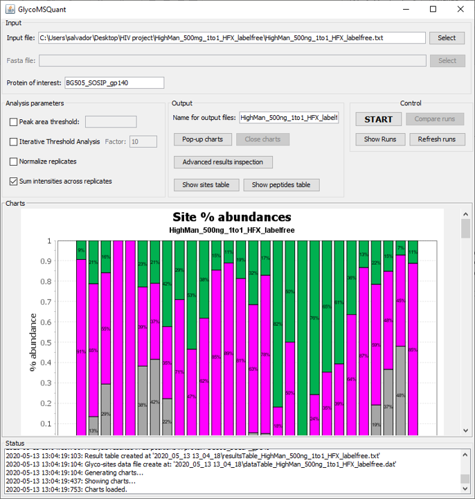
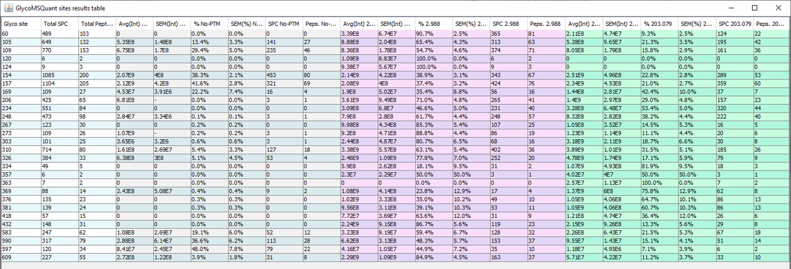
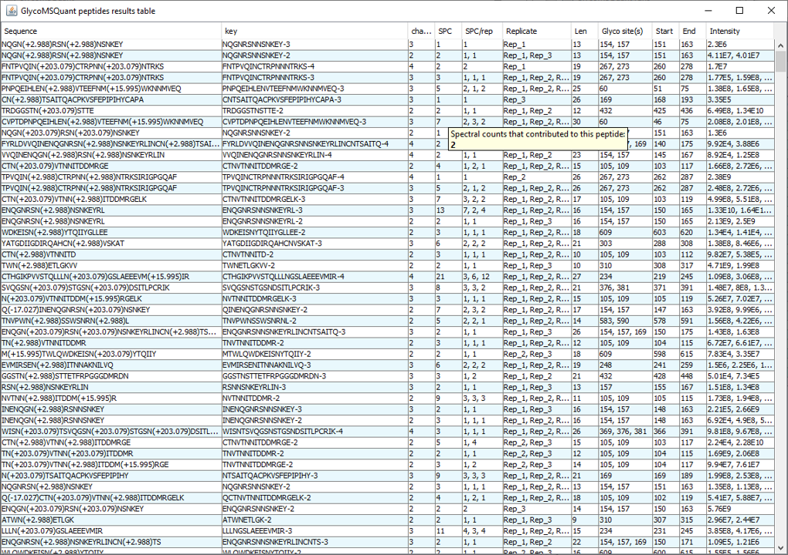
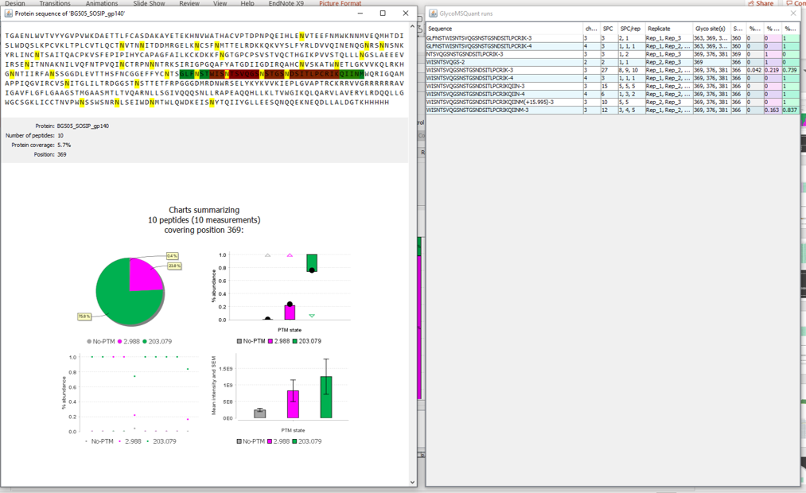

# GlycoMSQuant

GlycoMSQuant is a tool that helps to quantify specific sites of proteins that can be modified with different glycans.  
  
This software provides a graphical interface that allows the user to analyze the data and visualize it in different ways.  

Get the latest version from http://sealion.scripps.edu/GlycoMSQuant/  
  
Some captures here:
  
**Principal interface:**  
  
  
**Table with all quanfied sites information:**
 
  
**Table with all peptides information:**
 
  
**Advanced results exploration:**
 

